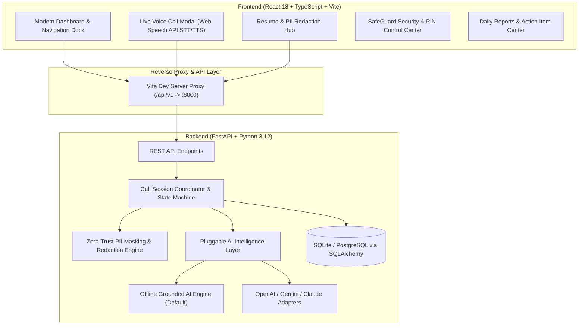

# AURA — Autonomous AI Personal Call Assistant

[](https://fastapi.tiangolo.com)
[](https://reactjs.org)
[](https://vitejs.dev)
[](https://tailwindcss.com)
[](https://pytest.org)
[](https://github.com)

**AURA** (Autonomous Unified Representative Agent) is a full-stack, real-time AI call assistant designed to represent users when they are unavailable, in deep focus, or unable to take phone or video calls.

AURA answers callers with natural conversational turn-taking, classifies caller intent, protects personal privacy, strictly grounds interview questions in the candidate's approved resume, and detects critical emergencies requiring secure PIN verification.

---

## Architecture Overview



---

## Key Features

### 1. Real-Time Spoken Live Calls & Animated Avatar
- Continuous voice turn-taking with browser speech recognition (STT) and text-to-speech synthesis (TTS).
- Reactive orbital avatar with 5 synchronized states: `CONNECTING`, `LISTENING`, `THINKING`, `SPEAKING`, and `COMPLETED`.
- Live visual audio waveforms showing mic and speaker energy levels.

### 2. Dynamic Resume Grounding & Zero-Hallucination Policy
- Upload any resume file (`.txt`, `.md`) or paste text.
- Automatically parses candidate name, summary, work experience, projects, skills, education, certifications, and achievements.
- Answers recruiter questions strictly using facts present in the uploaded resume.
- Any unlisted skills, technologies, or past roles trigger an anti-hallucination refusal:
  > *"I don't have that information available in their resume, so I'll ask the person I'm representing to follow up with you directly."*

### 3. Automated PII Protection & Privacy Shield
- Real-time detection and redaction of sensitive personal data:
  - Phone numbers (`[PHONE REDACTED]`)
  - Personal email addresses (`[EMAIL REDACTED]`)
  - Physical home addresses (`[ADDRESS REDACTED]`)
  - SSN & Government IDs (`[SSN REDACTED]`)
  - Dates of Birth (`[DOB REDACTED]`)
  - Confidential salary, package, and compensation figures
- Sensitive inquiries are politely withheld during live calls and logged as private items.

### 4. Intent Classification Engine
Classifies every incoming call turn into 7 distinct categories:
- `INTERVIEW`: Recruiter questions, candidate qualifications, technical skills.
- `EMERGENCY`: Hospital admissions, car crashes, severe health alerts.
- `BUSINESS`: Client meetings, contract discussions, scheduling requests.
- `PERSONAL`: Friends and family check-ins.
- `SPAM`: Robocalls, warranty offers, unsolicited marketing.
- `NORMAL`: General non-critical phone inquiries.
- `UNKNOWN`: Unclear or silent audio turns.

### 5. Contextual Emergency Detection & Secure PIN Dismissal
- Automatically identifies urgent medical or safety crises.
- Flags urgent alerts to the user's dashboard with bypass protocols.
- Requires a secure security PIN (Default: `1234`) to verify and dismiss emergency events.

### 6. Post-Call Summaries & Action Items
- Generates executive call overviews, key decisions, questions asked/answered, and priority action items.
- Aggregates daily intelligence reports with call volume and sentiment breakdown.

---

## Project Structure

```
AURA_11/
├── backend/
│   ├── app/
│   │   ├── ai/
│   │   │   ├── base.py            # AI provider interfaces and response schemas
│   │   │   ├── mock_provider.py   # High-fidelity deterministic grounded AI engine
│   │   │   ├── cloud_provider.py  # Pluggable OpenAI / Gemini / Claude client
│   │   │   └── factory.py         # AI provider dependency injection
│   │   ├── api/
│   │   │   └── endpoints.py       # FastAPI REST endpoints
│   │   ├── core/
│   │   │   ├── config.py          # App settings and environment config
│   │   │   ├── database.py        # SQLAlchemy session and engine
│   │   │   └── seed.py            # Initial baseline seed data
│   │   ├── models/
│   │   │   └── entities.py        # Database models (User, Call, Resume, etc.)
│   │   ├── schemas/
│   │   │   └── domain.py          # Pydantic request/response schemas
│   │   ├── services/
│   │   │   └── session_service.py # Call coordination and state machine
│   │   └── main.py                # FastAPI app initialization & CORS
│   ├── tests/
│   │   ├── test_foundation.py     # System health and core CRUD tests
│   │   └── test_phase2_ai_telephony.py # AI grounding & telephony tests
│   ├── requirements.txt           # Python dependencies
│   └── aura.db                    # SQLite database
├── frontend/
│   ├── src/
│   │   ├── components/            # Reusable UI widgets and layout
│   │   ├── context/               # Global state (AuraStateContext)
│   │   ├── hooks/
│   │   │   └── useVoiceCall.ts    # STT / TTS microphone & speaker hook
│   │   ├── pages/
│   │   │   ├── DashboardPage.tsx
│   │   │   ├── CallsPage.tsx
│   │   │   ├── LiveCallPage.tsx   # Real-time spoken conversation interface
│   │   │   ├── ResumePage.tsx     # Resume upload & PII redaction scanner
│   │   │   ├── InterviewAssistantPage.tsx # Grounding query tester
│   │   │   ├── EmergencyCenterPage.tsx
│   │   │   ├── DailyReportsPage.tsx
│   │   │   └── SettingsPage.tsx
│   │   ├── services/
│   │   │   ├── api.ts             # Typed REST API client
│   │   │   └── resumeKnowledge.ts # Client knowledge base & PII sanitizer
│   │   ├── App.tsx
│   │   └── main.tsx
│   ├── package.json
│   ├── vite.config.ts
│   └── tailwind.config.js
├── start_backend.bat              # One-click backend launcher
├── start_services.bat             # One-click full-stack launcher
└── README.md
```

---

## Quickstart Guide

### Option A: One-Click Launcher (Windows)

Simply double-click `start_services.bat` in the root folder. It starts:
1. Backend Uvicorn server on `http://127.0.0.1:8000`
2. Frontend Vite server on `http://localhost:5173` (or `5177`)

---

### Option B: Manual Setup

#### 1. Backend Setup (FastAPI + Python 3.10+)

```bash
cd backend

# Create virtual environment (optional)
python -m venv .venv
.venv\Scripts\activate   # On Windows
# source .venv/bin/activate # On Linux/macOS

# Install dependencies
pip install -r requirements.txt

# Start backend server
python -m uvicorn app.main:app --host 127.0.0.1 --port 8000 --reload
```

The backend will be available at:
- **API URL**: `http://127.0.0.1:8000`
- **Interactive Swagger Docs**: `http://127.0.0.1:8000/docs`
- **Default Emergency Dismissal PIN**: `1234`

#### 2. Frontend Setup (React + Vite + Tailwind CSS)

In a separate terminal window:

```bash
cd frontend

# Install dependencies
npm install

# Start development server
npm run dev
```

Open `http://localhost:5173` in your browser.

---

## Running the Automated Test Suite

```bash
cd backend
python -m pytest tests/ -v
```

All 10 unit and integration tests will execute:
- Health check & database connection
- User authentication & profile fetching
- Call lifecycle (simulate, interact, finalize)
- Grounded resume answers & unlisted skill refusal
- Emergency detection & PIN dismissal
- Telephony session lifecycle

---

## API Reference (Core Endpoints)

| Method | Endpoint | Description |
|---|---|---|
| `GET` | `/api/v1/health` | Service health status |
| `GET` | `/api/v1/user/me` | Fetch active user credentials and settings |
| `GET` | `/api/v1/calls` | List call history with filtering (category, urgency) |
| `POST` | `/api/v1/calls/simulate` | Initiate a simulated incoming call session |
| `POST` | `/api/v1/calls/{id}/interact` | Send spoken/text caller turn and receive grounded reply |
| `POST` | `/api/v1/calls/{id}/finalize` | End call and generate summary + action items |
| `GET` | `/api/v1/profile/resume` | Retrieve the latest uploaded candidate resume |
| `POST` | `/api/v1/profile/resume` | Upload & persist a new resume with PII masks |
| `GET` | `/api/v1/profile/professional` | Retrieve structured professional profile |
| `GET` | `/api/v1/emergency/events` | List emergency crisis events |
| `POST` | `/api/v1/emergency/dismiss` | Dismiss active emergency event with PIN verification |
| `GET` | `/api/v1/reports/daily` | Fetch daily aggregate intelligence report |
| `GET` | `/api/v1/action-items` | List extracted post-call tasks and follow-ups |

---

## License

MIT License. Designed and engineered for production-grade hackathon demonstrations.
