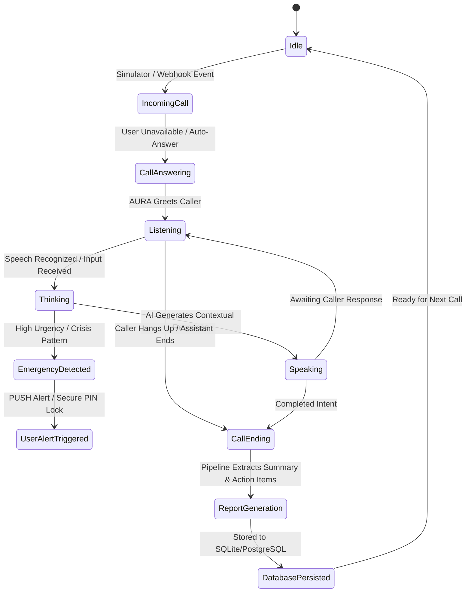
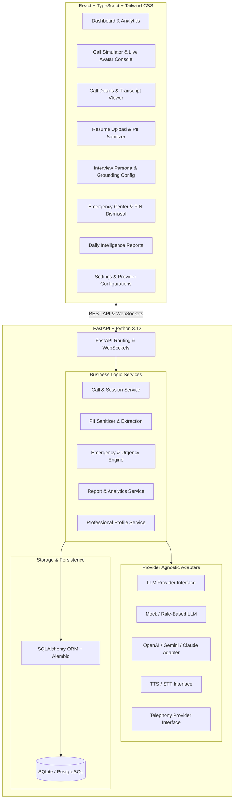

# AURA (AI Personal Call Assistant) — System Specification & Architecture

## 1. Executive Summary
AURA is an autonomous AI-powered personal call assistant designed to represent a user when they are unavailable (in meetings, sleeping, commuting, or away). Unlike simple voicemail or rudimentary auto-attendants, AURA dynamically engages callers in multi-turn conversation, contextually classifies the nature and urgency of the call, protects personal privacy (PII) during interview scenarios, detects emergencies with high-priority user alerting, and generates actionable post-call reports.

---

## 2. Core User Flows & State Machine



---

## 3. System Architecture



---

## 4. Call Categories & Urgency Matrix

### Call Categories
1. **NORMAL**: General inquiries, casual updates, routine follow-ups.
2. **INTERVIEW**: HR screening, technical interviews, recruiter reach-outs. Triggers strict verified-profile grounding.
3. **BUSINESS**: Client queries, vendor updates, partnership opportunities, invoice/work discussions.
4. **PERSONAL**: Friends, family members, personal acquaintances.
5. **SPAM**: Robocalls, unsolicited marketing, phishing attempts. Kept brief or disconnected politely.
6. **EMERGENCY**: Medical emergencies, accidents, urgent family distress, critical infrastructure failures.
7. **UNKNOWN**: Inconclusive intent; prompts the caller for clarification.

### Urgency Levels
- `NORMAL` (Weight 1)
- `LOW_PRIORITY` (Weight 2)
- `IMPORTANT` (Weight 3)
- `URGENT` (Weight 4)
- `POTENTIAL_EMERGENCY` (Weight 5 — triggers visual/audio alarm & PIN unlock)

---

## 5. Privacy & Interview Grounding Engine

### PII Sanitization Flow:
```
Raw Resume (PDF/TXT/Docx)
  ↓
Text Extraction
  ↓
Regex & NLP Masking:
  - Phone numbers (\b\d{3}[-.]?\d{3}[-.]?\d{4}\b, etc.)
  - Emails ([a-zA-Z0-9_.+-]+@[a-zA-Z0-9-]+\.[a-zA-Z0-9-.]+)
  - Physical Addresses & Postal Codes
  - Government IDs / SSN / Aadhaar / Passport numbers
  - Date of Birth & Age
  ↓
Sanitized Professional Profile Entity:
  - Summary / Title
  - Verified Skills
  - Education (Degrees, Universities, Graduation Years)
  - Work Experience & Internships (Company, Role, Dates, Achievements)
  - Projects (Name, Tech Stack, Description, Outcomes)
  - Certifications & Honors
  ↓
Strict Interview LLM System Prompt:
  - Answer using ONLY verified information.
  - Reject hallucination on unlisted salary expectations, notice period, or unverified skills.
  - "The candidate has not provided this information in their profile, but I will make a note for them to get back to you directly."
```

---

## 6. Video AI Avatar States

The visual console provides an interactive animated visual avatar representing AURA:
1. **Connecting**: Pulsing amber ring, establishing connection.
2. **Listening**: Fluid teal/cyan ripples reacting to caller voice/input.
3. **Thinking**: Rotating violet halo with neural glow animation.
4. **Speaking**: Dynamic multi-frequency audio waveform bars with blue/emerald glow.
5. **Call Ended**: Neutral slate indicator displaying call duration and handoff badge.
*Clear AI Transparency Disclaimer*: Visible pill label "AURA AI Call Assistant — Representing [User Name]".

---

## 7. Database Entity Schema

1. **User**: `id, email, full_name, phone_number, created_at, updated_at`
2. **UserProfile**: `id, user_id, bio, current_title, company, timezone, status_message`
3. **SecuritySettings**: `id, user_id, emergency_pin_hash, dnd_bypass_demo_mode, notify_email, notify_sms`
4. **Resume**: `id, user_id, filename, file_path, raw_text, pii_detected, created_at`
5. **ProfessionalProfile**: `id, user_id, resume_id, summary, skills (JSON), work_experience (JSON), education (JSON), projects (JSON), certifications (JSON), is_active`
6. **Call**: `id, user_id, caller_number, caller_name, category, urgency, status, started_at, ended_at, duration_seconds`
7. **CallParticipant**: `id, call_id, role (caller/assistant), name, phone`
8. **CallTranscript**: `id, call_id, speaker (CALLER/ASSISTANT), text, timestamp_offset_ms, confidence`
9. **CallClassification**: `id, call_id, primary_category, confidence, secondary_categories (JSON), reasoning`
10. **CallSummary**: `id, call_id, overview, key_decisions (JSON), questions_asked (JSON), follow_ups (JSON), ai_confidence`
11. **ActionItem**: `id, call_id, task, assignee, due_date, priority, is_completed`
12. **EmergencyEvent**: `id, call_id, severity, trigger_reason, is_dismissed, dismissed_at, dismissed_by`
13. **DailyReport**: `id, user_id, report_date, total_calls, category_breakdown (JSON), high_priority_count, executive_summary, created_at`
14. **Notification**: `id, user_id, call_id, title, message, level, is_read, created_at`

---

## 8. Phased Development Roadmap

- **Phase 1: Project Foundation & Core Architecture**
  - Backend directory structure, dependencies (`requirements.txt`), FastAPI bootstrap, SQLite/PostgreSQL configuration, complete SQLAlchemy ORM models, Pydantic schemas, and database initialization.
  - Frontend initialization with Vite, React, TypeScript, Tailwind CSS, Lucide icons, responsive layout, navigation sidebar, and mock API client.
- **Phase 2: Provider-Independent AI, Voice & Telephony Abstraction**
  - Abstract base interfaces (`LLMProvider`, `VoiceProvider`, `TelephonyProvider`).
  - Robust mock/heuristic implementation for immediate offline demonstration.
  - Dynamic cloud LLM provider adapter (configurable via environment variables).
  - Call session state machine with real-time transcript streaming.
- **Phase 3: Resume Upload, PII Redaction & Interview Grounding Engine**
  - Resume upload endpoint & text extractor.
  - PII detection & masking algorithms (regex + contextual sanitization).
  - Sanitized professional profile generator.
  - Interview mode prompt builder with anti-hallucination constraints.
  - Frontend Resume & Interview management UI.
- **Phase 4: Emergency Detection & Demo Alert Bypass**
  - Urgency analysis engine with contextual multi-turn reasoning.
  - High-priority modal/audio alert system with secure PIN dismiss.
  - Notification / DND bypass demo abstraction with clear browser capability disclaimers.
  - Frontend Emergency Center dashboard.
- **Phase 5: Live Call Simulator & Video AI Avatar UI**
  - Realistic incoming call simulation modal (caller ID, answer/decline, video vs voice).
  - Active call console with 5-state animated AI avatar, real-time waveform, and live transcript chat bubble stream.
  - Post-call report generation pipeline (overview, decisions, action items, questions).
- **Phase 6: Comprehensive Dashboards, Daily Reports & Hackathon Polish**
  - Dashboard overview with stats, call history table, call detail view.
  - Daily intelligence report aggregator.
  - Settings page for AI provider keys, avatar customization, and PIN configuration.
  - Unit tests for backend services, build verification, and end-to-end demo walkthrough.
